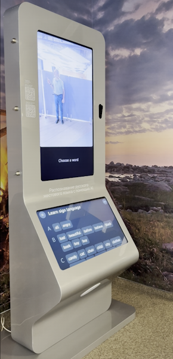

# Automated Sign Language Tutor Project

This is the official repository for the paper _"Automated Sign Language Tutor: A Dual-Language Real-Time Approach
for RSL and ASL"_.

Appearance and video of the stand operation:
<div style="display: flex; align-items: center; gap: 20px; margin: 20px 0;">
  
  <a href="https://youtu.be/O9SDAkhRrK0" style="display: block;">
    
  </a>
</div>

Important Note: This repository contains a backend system for sign language recognition (Streaming Sign Recognition Engine and Controller Process components). The provided frontend (ws.html, ws.css, ws.js) serves as a basic example implementation to demonstrate backend functionality and is not a production-ready application. Developers should create their own frontend implementations tailored to specific use cases while using this backend as a recognition service.

It is also possible to use the backend with custom models.

## Key Features
1. **Two operating modes**:
   - **LIVE**: Real-time gesture recognition
   - **Training**: Mode for teaching the model new gestures
2. **Dual language support**: Russian and English interface and recognition models
3. **WebSocket interaction**: Client sends video stream, server returns recognized gestures
4. **Visual feedback**: Notification system for users
5. **Responsive interface**: Modern design, user-friendly

## Setup and Installation

### Prerequisites
- Python 3.7+
- Node.js (optional for frontend)
- Web camera

### Installing Dependencies
```bash
pip install -r requirements.txt
```

### Models Downloading 
Download the models

- https://rndml-team-cv.obs.ru-moscow-1.hc.sbercloud.ru/rsl/demostand_models/tsm/ru/mobilenet_demostand_ru.onnx
- https://rndml-team-cv.obs.ru-moscow-1.hc.sbercloud.ru/rsl/demostand_models/tsm/en/mobilenet_demostand_en.onnx

and place them in the folder `models/checkpoints/`.

### Running the Server
```bash
python server_fapi.py
```

The server will run at `localhost:3003`.

### Docker Deployment
```bash
docker build -t sign-tutor .
docker run -it -d -v $PWD:/app -p 3003:3003 sign-tutor
```

## Using the Web Interface
1. Open `ws.html` in your browser
2. Click "Enable Camera" to access your webcam
3. After enabling the camera, the "Start Stream" button will become available
4. Select operating mode:
   - **LIVE**: Real-time gesture recognition
   - **Training**:
     - Enter gesture name in the text field
     - Click "Select Gesture"
     - Perform the gesture in front of the camera
     - The system will notify you when the gesture is recognized correctly
5. Switching interface and model language: Use the RU/EN buttons in the top right corner
6. The recognition result is displayed in the server console.

## Working with custom models

1. Place ONNX models for Russian and English in the `models/checkpoints/` folder

2. Update the configuration files:
- `models/config_ru.yaml` for the Russian model,
- `models/config_en.yaml` for the English model.

Use the available files as examples.

3. Update the sign class files:
- `models/constants_ru.py ` with the `classes' variable for Russian,
   - `models/constants_en.py ` with the `classes' variable for English.

Use the available files as examples.

## System Architecture

### Client-Server Interaction
1. **Establishing connection**:
   - Client opens WebSocket connection to `ws://localhost:3003/`
   - Server initializes the default language model (Russian)

2. **Main workflow**:


### Key Components

**Client (Frontend)**:
- `view/ws.html`: Main HTML interface file
- `view/ws.css`: Interface styles
- `view/ws.js`: Camera and WebSocket logic

**Server (Backend)**:
- `server_fapi.py`: Main server code (FastAPI)
- `models/model.py`: Recognition model logic
- `Runner`: Class for managing video processing flow
- `RecognitionMP`: Process for gesture recognition in a separate thread

**Model**:
- ONNX models for gesture recognition
- Configuration files for Russian and English versions
- Gesture class files for each language

## Implementation Details

### Client-Side
1. **Camera management**:
   - Webcam access via WebRTC
   - Frame capture and base64 encoding
   - Frame sending at specified frequency (30 FPS)

2. **Mode management**:
   - Smooth switching between LIVE and Training modes
   - Dynamic UI element display based on current mode

3. **Localization**:
   - Full support for Russian and English
   - Language preference persistence between sessions

4. **Feedback**:
   - Animated notification system
   - Visual confirmation of user actions
   - Error handling and display

### Server-Side
1. **Video processing**:
   - Base64 decoding to OpenCV image
   - Frame preprocessing for neural network
   - Frame buffering for sequence analysis

2. **Model management**:
   - Dynamic model loading for different languages
   - Multithreaded processing to minimize latency
   - Proper resource cleanup when switching languages

3. **Gesture recognition**:
   - Sequence analysis for gesture recognition
   - Threshold filtering to reduce false positives

## Configuration and Customization

### Changing Parameters
1. **Frame rate**: Change the `FPS` value in `ws.js`
2. **Video resolution**: Change `width` and `height` attributes of the `<video>` element in `ws.html`
3. **Recognition threshold**: Change the `threshold` value in model configuration files

### Adding New Languages
1. Create a new configuration file `models/config_<language>.yaml`
2. Add a gesture class file `models/constants_<language>.py`
3. Update translation dictionaries in `ws.js`:
```javascript
const translations = {
    // ...
    <language>: {
        title: "...",
        startWebcam: "...",
        // ... other texts
    }
}
```

## Troubleshooting

### Common Issues
1. **Camera not working**:
   - Check browser permissions
   - Ensure no other applications are using the camera
   - Try reloading the page

2. **No connection to server**:
   - Ensure the server is running (`python server_fapi.py`)
   - Check WebSocket address in `ws.js`
   - Ensure no firewall blocking

3. **Model not loading**:
   - Check model paths in configuration files
   - Ensure model files exist
   - Verify content of gesture class files

### Logging
1. **Client**: Open browser developer console (F12)
2. **Server**: Logs are printed in the server console

## Authors
— [Petr Surovtsev]()  
— [Alexander Nagaev](https://github.com/nagadit)  
— [Alexander Kapitanov](https://github.com/hukenovs/)  
— [Ilya Ovodov](https://github.com/IlyaOvodov)  

## License
This project is licensed under the APACHE License. See the LICENSE file for details.

For questions and suggestions, please use the project's Issues section.
