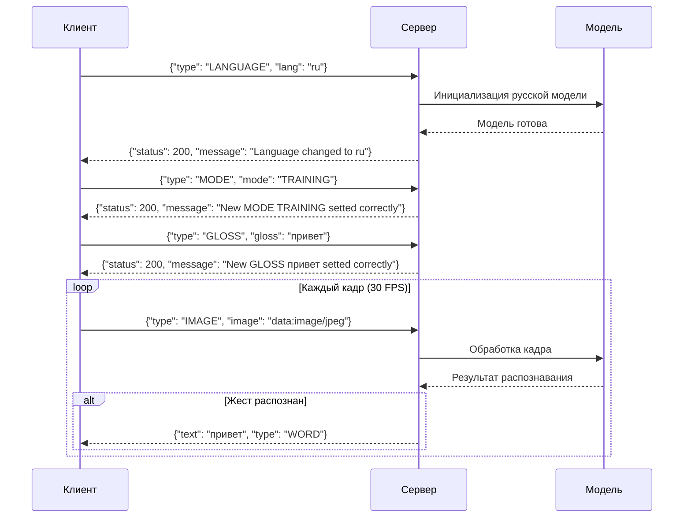

# Automated Sign Language Tutor Project

Важное примечание: Этот репозиторий содержит демонстрационную бэкенд-систему для распознавания языка жестов. Предоставленный фронтенд (ws.html, ws.css, ws.js) служит базовым примером реализации для демонстрации функциональности бэкенда и не является готовым к эксплуатации приложением. Разработчики должны создавать свои собственные фронтенд-реализации, соответствующие конкретным случаям использования, используя этот бэкенд в качестве сервиса распознавания.

## Основные возможности
1. **Два режима работы**:
   - **LIVE**: Режим реального времени для распознавания жестов
   - **Тренировка**: Режим для обучения модели новым жестам
2. **Поддержка двух языков**: Русский и английский интерфейс и модели распознавания
3. **Взаимодействие через WebSocket**: Клиент отправляет видеопоток, сервер возвращает распознанные жесты
4. **Визуальная обратная связь**: Система уведомлений для пользователя

## Установка и запуск

### Предварительные требования
- Python 3.7+
- Веб-камера

### Установка зависимостей
```bash
pip install -r requirements.txt
```

### Конфигурация моделей
1. Поместите модели для русского и английского языков в папку `models/checkpoints/`
2. Создайте конфигурационные файлы:
   - `models/config_ru.yaml` для русской модели
   - `models/config_en.yaml` для английской модели

Пример конфигурационного файла:
```yaml
model_path: "models/checkpoints/mobilenet_demostand_ru.onnx"
frame_interval: 2
stride: 8
window_size: 16
threshold: 0.6
mean: [123.675, 116.28, 103.53]
std: [58.395, 57.12, 57.375]
```

3. Создайте файлы с классами жестов:
   - `models/constants_ru.py` с переменной `classes` для русского языка
   - `models/constants_en.py` с переменной `classes` для английского языка

Пример файла constants_ru.py:
```python
classes = [
    "привет",
    "пока",
    "спасибо",
    "пожалуйста",
    "да",
    "нет"
]
```

### Запуск сервера
```bash
python server_fapi.py
```

Сервер запустится на `localhost:3003`.

### Запуск через Docker
```bash
docker build -t sign-tutor .
docker run -it -d -v $PWD:/app -p 3003:3003 sign-tutor
```

## Использование веб-интерфейса
1. Откройте `ws.html` в браузере
2. Нажмите "Включить камеру" для доступа к веб-камере
3. После включения камеры станет доступна кнопка "Запустить стрим"
4. Выберите режим работы:
   - **LIVE**: Распознавание жестов в реальном времени
   - **Тренировка**:
     - Введите название жеста в текстовое поле
     - Нажмите "Выбрать жест"
     - Показывайте жест перед камерой
     - Система сообщит, когда жест распознан правильно
5. Переключение языка интерфейса и модели: используйте кнопки RU/EN в правом верхнем углу

## Архитектура системы

### Взаимодействие клиент-сервер
1. **Установка соединения**:
   - Клиент открывает WebSocket соединение с `ws://localhost:3003/`
   - Сервер инициализирует модель для языка по умолчанию (русский)

2. **Основной цикл работы**:


### Ключевые компоненты

**Клиент (Frontend)**:
- `view/ws.html`: Основной HTML-файл интерфейса
- `view/ws.css`: Стили интерфейса
- `view/ws.js`: Логика работы с камерой и WebSocket

**Сервер (Backend)**:
- `server_fapi.py`: Основной серверный код (FastAPI)
- `models/model.py`: Логика работы с моделью распознавания
- `Runner`: Класс для управления потоком обработки видео
- `RecognitionMP`: Процесс для распознавания жестов в отдельном потоке

**Модель**:
- ONNX-модели для распознавания жестов
- Конфигурационные файлы для русской и английской версий
- Файлы с классами жестов для каждого языка

## Особенности реализации

### Клиентская часть
1. **Управление камерой**:
   - Получение доступа к веб-камере через WebRTC
   - Захват и кодирование кадров в base64
   - Отправка кадров с заданной частотой (30 FPS)

2. **Управление режимами**:
   - Плавное переключение между режимами LIVE и Тренировка
   - Динамическое отображение элементов интерфейса в зависимости от режима

3. **Локализация**:
   - Полная поддержка русского и английского языков
   - Сохранение выбора языка между сессиями
   - Автоматическое определение языка браузера

4. **Обратная связь**:
   - Система уведомлений с анимацией
   - Визуальное подтверждение действий пользователя
   - Обработка и отображение ошибок

### Серверная часть
1. **Обработка видео**:
   - Декодирование base64 в изображение OpenCV
   - Предобработка кадров для нейронной сети
   - Буферизация кадров для анализа последовательностей

2. **Управление моделью**:
   - Динамическая загрузка моделей для разных языков
   - Многопоточная обработка для минимизации задержек
   - Корректное освобождение ресурсов при переключении языков

3. **Распознавание жестов**:
   - Анализ последовательности кадров для распознавания жестов
   - Пороговая фильтрация для уменьшения ложных срабатываний

## Настройка и кастомизация

### Изменение параметров
1. **Частота кадров**: Измените значение `FPS` в `ws.js`
2. **Разрешение видео**: Измените атрибуты `width` и `height` у элемента `<video>` в `ws.html`
3. **Порог распознавания**: Измените значение `threshold` в конфигурационных файлах моделей

### Добавление новых языков
1. Создайте новый конфигурационный файл `models/config_<язык>.yaml`
2. Добавьте файл с классами жестов `models/constants_<язык>.py`
3. Обновите словари переводов в `ws.js`:
```javascript
const translations = {
    // ...
    <язык>: {
        title: "...",
        startWebcam: "...",
        // ... остальные тексты
    }
}
```

## Устранение неполадок

### Общие проблемы
1. **Не работает камера**:
   - Проверьте разрешения браузера
   - Убедитесь, что нет других приложений, использующих камеру
   - Попробуйте перезагрузить страницу

2. **Нет соединения с сервером**:
   - Убедитесь, что сервер запущен (`python server_fapi.py`)
   - Проверьте адрес WebSocket в `ws.js`
   - Убедитесь, что нет блокировки брандмауэром

3. **Модель не загружается**:
   - Проверьте пути к моделям в конфигурационных файлах
   - Убедитесь, что файлы моделей существуют
   - Проверьте содержимое файлов с классами жестов

### Логирование
1. **Клиент**: Откройте консоль разработчика в браузере (F12)
2. **Сервер**: Логи выводятся в консоль, где запущен сервер

## Лицензия
Проект распространяется под лицензией APACHE. Подробнее см. в файле LICENSE.

Для вопросов и предложений обращайтесь в раздел Issues проекта.
